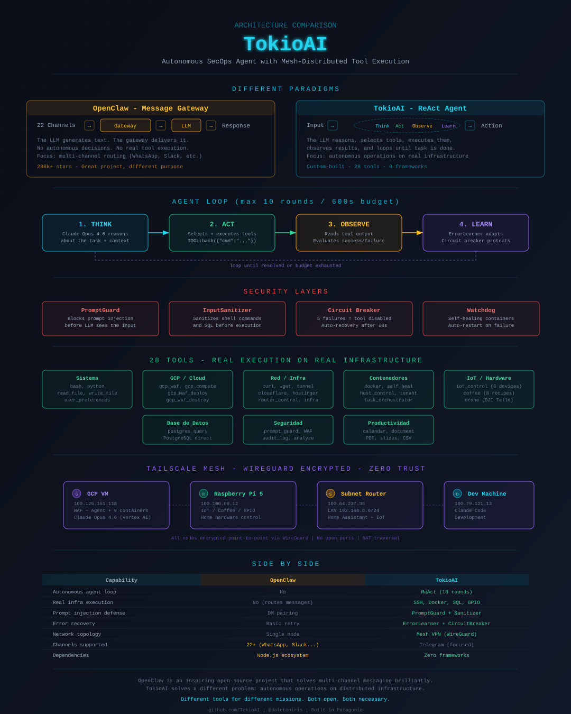

<div align="right">

[](README.md)
[](README_ES.md)

</div>

<div align="center">

```
████████╗ ██████╗ ██╗  ██╗██╗ ██████╗      █████╗ ██╗
╚══██╔══╝██╔═══██╗██║ ██╔╝██║██╔═══██╗    ██╔══██╗██║
   ██║   ██║   ██║█████╔╝ ██║██║   ██║    ███████║██║
   ██║   ██║   ██║██╔═██╗ ██║██║   ██║    ██╔══██║██║
   ██║   ╚██████╔╝██║  ██╗██║╚██████╔╝    ██║  ██║██║
   ╚═╝    ╚═════╝ ╚═╝  ╚═╝╚═╝ ╚═════╝     ╚═╝  ╚═╝╚═╝
```

### Autonomous AI Agent Framework — Offensive & Defensive

**Connect an LLM to your entire infrastructure. Not a chatbot — an agent that gets things done.**

[](https://python.org)
[](https://fastapi.tiangolo.com)
[](https://docker.com)
[](LICENSE)
[](#telegram-bot)
[](https://tokioia.com)

<br>

*TokioAI connects Claude, GPT, Gemini, OpenRouter, or Ollama to your servers, databases, Docker containers, IoT devices, drones, security tools, and cloud infrastructure through native tool-calling. 5 LLM providers, 30+ tools, streaming CLI, auto-compaction, subagents, and self-healing — built for hackers, pentesters, and security researchers.*

[Getting Started](#-quick-start) · [Features](#-features) · [What's New](#-whats-new-in-v30) · [Drone Control](#-drone-control) · [Security Tools](#-offensive--defensive-security-tools) · [SOC Terminal](#-soc-terminal-v2) · [WAF Dashboard](#-waf-dashboard) · [Architecture](#-architecture) · [Writings](#-writings)

</div>

---

## What's New in v3.0

<table>
<tr>
<td width="50%">

**Native Tool Use**
- Switched from regex-based `TOOL:name({})` parsing to structured JSON tool calls via LLM API
- Configurable rounds (25 default, 0 = unlimited)
- Parallel tool execution for independent operations
- ~21% reduction in prompt tokens

</td>
<td width="50%">

**5 LLM Providers**
- All providers now support native tool use and streaming
- **OpenRouter** — access 200+ models (Claude, GPT, Llama, Mixtral, DeepSeek)
- **Ollama** — run LLMs locally for free, auto-detects models
- Automatic fallback chain with retries across all providers

</td>
</tr>
<tr>
<td>

**Claude Code-style CLI**
- Streaming responses (token by token)
- **Unlimited mode** — no round or time limits (`--unlimited`)
- **Persistent mode** — keeps working until you say "stop" (`--persistent`)
- Escape to cancel running requests
- Tool icons with real-time execution feedback
- Status bar, readline history, sensitive data masking

</td>
<td>

**Auto-Compaction & Memory**
- Context auto-compacts at 80% capacity (circuit breaker: 3 per 5min)
- Background memory extraction after each response
- Per-user preference and memory isolation
- Subagent workers for parallel task execution
- Self-healing engine (auto-restarts crashed services)

</td>
</tr>
</table>

---

## Demo

```
tokio> give me a full status: weather, home, health, wifi defense, WAF attacks, containers

  [RP] raspi_vision health
      -> HR: 84 bpm (80-90), BP: 120/75, Status: OPTIMAL
  [RP] raspi_vision ha_status
      -> HA: ONLINE, Jarvis playing Beatles, Kitchen: 22.8C
  [RP] raspi_vision wifi
      -> Monitor: ACTIVE, Deauth: 0, Evil twins: 0, Counter-deauth: ON
  [>>] bash curl -s "https://api.met.no/weatherapi/..."
      -> 20C, clear sky, wind 5.3 m/s NNW
  [>>] bash ssh prod "sudo docker ps --format ..."
      -> 9/9 containers UP, 2 weeks uptime
  [>>] bash ssh prod "sudo docker logs waf-proxy | tail"
      -> 4 attackers blocked: 68.183.x.x (git scanner), 172.245.x.x (api prober)

Weather: 20C clear. House: 22.8C, Beatles playing.
Health: Optimal (HR 84, BP 120/75). WiFi: Clean.
WAF: 4 attackers blocked. Infra: 9/9 containers UP.

[23.1s | 18K tok | 8 tools]

tokio> connect the drone, take off, patrol in a square, and land

  [DR] drone wifi_connect
      -> Connected to T0K10-NET
  [DR] drone takeoff
      -> OK, altitude 1.2m
  [DR] drone patrol square 100
      -> Executing patrol... 4 waypoints complete
  [DR] drone land
      -> Landed safely. Battery: 68%

[31.2s | 12K tok | 5 tools]
```

### 🎬 Full Demo Video

<div align="center">

[](https://www.youtube.com/watch?v=Ll5UXBwXUzY)

**▶️ Click to watch** — Complete demo: CLI, Telegram Bot, WAF Dashboard, AI Vision, Drone, IoT, Health Monitor & more

</div>

---

## Philosophy

Most "AI tools" are chatbots with a nice UI. You type, it talks back. That's it.

**TokioAI was built with a different belief: AI should execute, not just respond.**

The world doesn't need another chatbot. It needs an agent that can restart your containers at 3 AM, fly a drone to patrol your perimeter, scan your network for vulnerabilities, block an attacker's IP in real-time, detect WiFi deauth attacks before they disrupt your operations, and SSH into your server to fix what's wrong — all while you sleep, all from a single Telegram message.

TokioAI is built by a security researcher who got tired of switching between 15 terminals, 8 dashboards, and 3 cloud consoles to do what one intelligent agent could do in seconds. Every tool in this framework exists because it solved a real problem in production, not because it looked good in a demo.

**Principles:**
- **Execute, don't chat** — Every tool does something real. No decorative features.
- **Hack & defend** — Offensive pentesting + defensive monitoring in one agent.
- **Security first** — Three layers of protection because an agent with bash access is a weapon. Treat it like one.
- **Own your infra** — Self-hosted, no SaaS dependencies, your data stays on your machines.
- **Simple > clever** — Python, Docker, PostgreSQL. No Kubernetes, no microservices, no buzzwords.

---

## Features

<table>
<tr>
<td width="50%">

### Multi-Provider LLM (5 providers)
- **Anthropic Claude** (Direct API or Vertex AI)
- **OpenAI GPT** (GPT-4o, GPT-5, o1, o3)
- **Google Gemini** (Flash, Pro)
- **OpenRouter** (200+ models via unified API)
- **Ollama** (run LLMs locally, 100% free)
- Native tool use on ALL providers
- Automatic fallback chain with retries

</td>
<td width="50%">

### Security Layers
- **Prompt Guard** — WAF for LLM prompts (injection detection + audit log to PostgreSQL)
- **Input Sanitizer** — Blocks reverse shells, crypto miners, fork bombs, SQL injection
- **API Auth** — Key-based authentication + rate limiting
- **Telegram ACL** — Owner-based access control

</td>
</tr>
<tr>
<td>

### 30+ Built-in Tools
| Category | Tools |
|:---------|:------|
| System | `bash`, `python`, `read_file`, `write_file`, `edit_file` |
| Search | `search_code` (ripgrep), `find_files` (glob), `list_files` |
| Docker | `ps`, `logs`, `start/stop/restart`, `exec`, `stats` |
| Database | `postgres_query` (SQL injection protected) |
| SSH | `host_control` (remote server management) |
| IoT | `iot_control` (lights, vacuum, sensors, Alexa) |
| Cloud | `gcp_waf`, `gcp_compute` (full GCP management) |
| Router | `router_control` (OpenWrt management) |
| Docs | `document` (generate PDF, PPTX, CSV) |
| Calendar | `calendar` (Google Calendar) |
| Orchestration | `subagent` (parallel worker spawning) |
| Vision | `raspi_vision` (camera, AI brain, health data) |
| **Drone** | `drone` (DJI Tello via safety proxy) |
| **Security** | `security` (nmap, vuln scan, WiFi defense) |
| **Coffee** | `coffee` (IoT coffee machine via GPIO) |

</td>
<td>

### Agent Engine (Claude Code-grade)
- **Native tool use** — Structured JSON tool calls via API (not regex parsing)
- **Streaming** — Token-by-token output with real-time tool execution feedback
- **Auto-compaction** — Automatic context management at 80% capacity
- **Auto-memory** — Background extraction of durable facts/preferences
- **Subagents** — Parallel worker orchestration for complex tasks
- **Skills system** — Slash commands (/status, /compact, /deploy, etc.)
- **Session memory** — Conversation history in PostgreSQL
- **Per-user isolation** — Each Telegram user has separate sessions, preferences, and memory
- **Error learning** — Remembers failures to avoid repeating them
- **Self-healing** — Auto-restarts crashed services, monitors containers
- **Plugin system** — Drop-in custom tools

</td>
</tr>
</table>

---

## Drone Control

TokioAI can fly a **DJI Tello drone** via Telegram commands. All commands are routed through a safety proxy running on a Raspberry Pi that enforces geofencing, rate limiting, and emergency kill switch.

### Architecture

```
Telegram                  GCP (Cloud)                     Raspberry Pi 5              Drone
┌─────────┐    ┌───────────────────────┐    ┌──────────────────────────┐    ┌──────────┐
│  User    │───>│  TokioAI Agent       │───>│  Safety Proxy (:5001)    │───>│  Tello   │
│  "take   │    │  (Claude Opus 4)     │    │  - Geofencing            │    │  (UDP)   │
│   off"   │    │  drone_proxy_tools.py │    │  - Rate limiting (10/5s) │    │          │
│          │<───│                       │<───│  - Kill switch           │    │          │
│  "OK,    │    │                       │    │  - Auto-land (<25% bat)  │    │          │
│   done"  │    │                       │    │  - WiFi mgmt (nmcli)     │    │          │
└─────────┘    └───────────────────────┘    └──────────────────────────┘    └──────────┘
                      Tailscale VPN                   WiFi 2.4GHz
                    (encrypted tunnel)              (WPA2 + 20-char key)
```

### Commands via Telegram

| Command | Action |
|:--------|:-------|
| "Connect the drone" | `wifi_connect` — Raspi switches to drone WiFi |
| "Take off" | `takeoff` — Drone takes off |
| "Move forward 50cm" | `move forward 50` — Move with distance |
| "Rotate 90 degrees" | `rotate clockwise 90` — Rotate in any direction |
| "Patrol in a square" | `patrol square 100` — Automated flight pattern |
| "Battery status" | `battery` — Check battery level |
| "Land" | `land` — Safe landing |
| "Emergency!" | `emergency` — Instant motor kill |
| "Disconnect the drone" | `wifi_disconnect` — Return to main WiFi |

### Safety Proxy Features

| Feature | Description |
|:--------|:------------|
| **Geofencing** | 3 levels: DEMO (1.5m height, 2m radius, 30cm/s), NORMAL, EXPERT |
| **Rate Limiting** | Max 10 commands per 5 seconds |
| **Kill Switch** | Instant motor stop via `/drone/kill` endpoint |
| **Auto-land** | Triggers on: battery <25%, command timeout 20s, height breach |
| **IP Whitelist** | Only Tailscale IPs can send commands |
| **Audit Log** | Full command history with timestamps |
| **WiFi Management** | Connect/disconnect drone WiFi from Telegram |
| **Watchdog** | Background thread monitors drone health during flight |

### Drone Proxy API (Raspberry Pi :5001)

```
POST /drone/command         — Execute command through safety proxy
GET  /drone/status          — Proxy + drone status
POST /drone/kill            — Emergency motor stop
POST /drone/kill/reset      — Reset kill switch after emergency
GET  /drone/audit           — Command audit log
GET  /drone/geofence        — Geofence configuration
POST /drone/wifi/connect    — Switch Raspi to drone WiFi
POST /drone/wifi/disconnect — Return to main WiFi
GET  /drone/wifi/status     — Current WiFi connection status
```

### Quick Start — Fly from Telegram

```
1. "Tokio, connect the drone"     → Raspi switches to Tello WiFi
2. "Tokio, take off"              → Drone takes off
3. "Tokio, move forward 100cm"    → Drone moves
4. "Tokio, patrol in a square"    → Automated pattern
5. "Tokio, land"                  → Safe landing
6. "Tokio, disconnect the drone"  → Back to main network
```

---

## Offensive & Defensive Security Tools

TokioAI includes a full suite of security tools for authorized pentesting, CTF challenges, and defensive monitoring. All tools are accessible via Telegram or CLI.

### Network Reconnaissance

```bash
# Quick network discovery
tokio> scan the network 192.168.8.0/24

# Full port scan with service detection
tokio> full scan on 192.168.8.1

# Stealth SYN scan
tokio> stealth scan 10.0.0.1

# UDP scan
tokio> UDP scan on the target

# OS detection
tokio> detect OS on 192.168.8.1
```

**Scan types:** `quick` (ping), `full` (version+scripts+OS), `vuln` (vulnerability scripts), `os` (OS detection), `ports` (specific ports), `stealth` (SYN+fragmented), `service` (deep service detection), `udp` (top 100 UDP ports)

### WiFi Security Monitoring

Real-time WiFi defense from the Raspberry Pi:

```bash
# WiFi status
tokio> check WiFi status

# Scan for threats (evil twins, open networks)
tokio> scan for WiFi threats

# Check for deauth attacks
tokio> check for deauth attacks

# List connected devices
tokio> show connected devices

# Signal strength monitoring
tokio> monitor signal strength
```

**Detection capabilities:**
- **Deauth attacks** — Monitors `dmesg` and `journalctl` for deauth/disassoc events; 3+ drops in 60s = attack confirmed
- **Evil twin detection** — Scans for SSIDs similar to your networks (T0K10-NET, TELLO clones)
- **Open network detection** — Flags unencrypted networks nearby
- **Signal anomalies** — High variance in signal strength indicates possible jamming
- **Connection history** — Tracks WiFi connect/disconnect events

### Vulnerability Assessment

```bash
# Web vulnerability scan (HTTP headers, SSL, security headers, DNS)
tokio> vulnerability scan on https://example.com type all

# SSL/TLS certificate check + weak cipher detection
tokio> check SSL on example.com

# Security headers analysis (HSTS, CSP, X-Frame-Options, etc.)
tokio> check security headers on https://example.com

# DNS reconnaissance + zone transfer check
tokio> DNS scan on example.com
```

### Web Application Testing

```bash
# HTTP header inspection
tokio> test headers on https://target.com

# Common directory/file enumeration
tokio> directory scan on https://target.com
# Checks: /.env, /robots.txt, /.git/config, /wp-login.php, /admin,
#          /api, /swagger.json, /graphql, /phpinfo.php, /backup.zip, etc.

# Technology detection
tokio> detect technology on https://target.com

# CORS misconfiguration testing
tokio> test CORS on https://target.com

# HTTP method testing
tokio> test methods on https://target.com

# robots.txt analysis
tokio> check robots.txt on https://target.com
```

### Network Analysis

```bash
# ARP table (local or Raspi)
tokio> show ARP table

# Routing table
tokio> show routes

# Open ports
tokio> show open ports

# Active connections
tokio> show active connections

# Network interfaces
tokio> show interfaces

# Traceroute
tokio> traceroute to 8.8.8.8

# Firewall rules
tokio> show firewall rules

# Tailscale mesh status
tokio> show Tailscale status
```

### Credential Auditing

```bash
# Password strength analysis
tokio> check password strength "MyP@ssw0rd123"
# Returns: score/8, rating (WEAK/MEDIUM/STRONG/EXCELLENT),
#          entropy bits, checks passed

# Hash type identification
tokio> identify hash 5f4dcc3b5aa765d61d8327deb882cf99
# Returns: possible types (MD5, SHA-1, bcrypt, Argon2, etc.)

# SSH server audit
tokio> SSH audit on 192.168.8.1
# Returns: key exchange algorithms, ciphers, MAC algorithms, vulnerabilities
```

### Security Tool Reference

| Tool | Action | Parameters |
|:-----|:-------|:-----------|
| `nmap` | Network scanning | `target`, `scan_type`, `ports` |
| `wifi_scan` | WiFi network discovery | `band`, `detail` |
| `wifi_monitor` | WiFi security monitoring | `action` (status/scan_threats/check_deauth/connected_devices/signal_history) |
| `vuln_scan` | Vulnerability assessment | `target`, `type` (web/ssl/headers/dns/all) |
| `web_test` | Web app testing | `target`, `test` (headers/dirs/tech/cors/methods/robots) |
| `net` | Network analysis | `action` (arp/routes/ports/connections/interfaces/tailscale/traceroute/dns/firewall) |
| `password` | Credential auditing | `action` (strength/hash_crack/ssh_audit), `password`/`hash`/`target` |

---

## SOC Terminal v2

Combined security operations center terminal with WAF monitoring, WiFi defense, and drone status. Built with Rich for live terminal rendering.

```
┌─────────────────────────────────────────────────────────────────────────┐
│                    TOKIOAI SOC TERMINAL v2                              │
│                 WAF + WiFi Defense + Drone Control                      │
├─────────────────────────────────────────────────────────────────────────┤
│                                                                         │
│  WAF: [LIVE] 13,443 threats    WiFi: [SAFE]    Drone: [LANDED] 87%    │
│                                                                         │
│  ┌─ LIVE ATTACKS ─────────────┐  ┌─ WiFi DEFENSE ─────────────────┐   │
│  │ 14:23 185.x.x SQLI /api   │  │ Signal: ████████░░ -45 dBm     │   │
│  │ 14:22 91.x.x  XSS /search │  │ Deauth: 0 events               │   │
│  │ 14:21 45.x.x  SCAN /.env  │  │ Evil twins: None               │   │
│  │ 14:20 [WiFi] Signal drop   │  │ Status: SAFE TO FLY            │   │
│  └────────────────────────────┘  └─────────────────────────────────┘   │
│                                                                         │
│  ┌─ DRONE ────────────────────┐  ┌─ AI NARRATOR ──────────────────┐   │
│  │ Status: Connected/Landed   │  │ "Detecting sustained SQLi      │   │
│  │ Battery: 87%               │  │  campaign from Eastern Europe. │   │
│  │ Geofence: DEMO (1.5m/2m)  │  │  3 IPs blocked in last hour.   │   │
│  │ Commands: 42 (0 blocked)   │  │  WiFi perimeter secure."       │   │
│  └────────────────────────────┘  └─────────────────────────────────┘   │
└─────────────────────────────────────────────────────────────────────────┘
```

### Running the SOC Terminal

```bash
# Live mode — connected to WAF API + Raspi + Drone proxy
cd tokio_cloud/gcp-live
python3 tokio_soc_v2.py --autonomous

# Demo mode — simulated data, no servers needed
python3 tokio_soc_v2.py --demo --autonomous

# Custom endpoints
python3 tokio_soc_v2.py \
  --api http://YOUR_WAF_SERVER:8000 \
  --user admin --pass YOUR_PASSWORD \
  --raspi-ip YOUR_RASPI_IP \
  --autonomous
```

### SOC Terminal Features

| Feature | Description |
|:--------|:------------|
| **WAF Live Feed** | Real-time attack stream from the WAF engine |
| **WiFi Defense Monitor** | SSH to Raspi, monitors deauth attacks, evil twins, signal anomalies |
| **Drone Status** | Live battery, geofence, command count from drone proxy |
| **Flight Authorization** | Blocks drone flight if WiFi attacks detected |
| **Autonomous AI Narrator** | Tokio analyzes WAF + WiFi + drone data and narrates in real-time |
| **Merged Timeline** | WAF attacks and WiFi events in a single chronological view |
| **Stats Panel** | Total threats, blocked IPs, active episodes, drone commands |

---

## Raspi Entity System

TokioAI runs as an animated AI entity on the Raspberry Pi 5 with an HDMI display — a face that reacts to the world around it.

### Components

| Module | Description |
|:-------|:------------|
| `main.py` | TokioEntity class — fullscreen face, camera PiP, WAF sidebar, voice, drone monitor |
| `tokio_face.py` | Animated face — hexagonal frame, rectangular eyes, scales to any screen |
| `vision_engine.py` | Hailo-8L YOLOv8 inference, camera capture, object detection |
| `face_db.py` | SQLite face recognition — histogram embeddings, roles (admin/friend/visitor) |
| `gesture_detector.py` | Hand gesture detection — OpenCV convex hull (peace, horns, OK, thumbs up) |
| `security_feed.py` | Polls GCP WAF API, maps attack severity to Tokio emotions |
| `api_server.py` | Flask API :5000 — /status, /snapshot, /face/register, /face/list, /thoughts |
| `drone_safety_proxy.py` | Drone proxy :5001 + WiFi management (systemd service) |
| `drone_tracker.py` | Visual drone tracker (camera-based tracking) |

### Tokio's Emotions

The face reacts to what's happening:
- **Calm** — No threats, normal operation
- **Alert** — Medium-severity WAF attacks detected
- **Angry** — Critical attacks or DDoS in progress
- **Happy** — Recognizes a known face (admin/friend)
- **Curious** — New person detected, analyzing
- **Excited** — Drone taking off, executing commands
- **Worried** — Low drone battery, WiFi interference

### Launch on Raspi

```bash
# Tokio UI (fullscreen face + camera + WAF + drone)
export XDG_RUNTIME_DIR=/run/user/1000 WAYLAND_DISPLAY=wayland-0 SDL_VIDEODRIVER=wayland
cd /home/mrmoz && python3 -m tokio_raspi --api

# Drone proxy (systemd, auto-starts on boot)
sudo systemctl start tokio-drone-proxy

# Manual drone WiFi connect/disconnect
./drone-on.sh
./drone-off.sh
```

### Keyboard Shortcuts

| Key | Action |
|:----|:-------|
| `R` | Register face as "Daniel" (admin) |
| `V` | Register face as "Visitante" (visitor) |
| `F` | Toggle fullscreen |
| `ESC` | Exit |

---

## Three Interfaces

<table>
<tr>
<td width="33%" align="center"><h3>CLI</h3></td>
<td width="33%" align="center"><h3>REST API</h3></td>
<td width="33%" align="center"><h3>Telegram Bot</h3></td>
</tr>
<tr>
<td>

Interactive terminal with Rich formatting

```
╔══════════════════════════╗
║  ████████╗ ██████╗  ...  ║
║  Autonomous AI Agent v2  ║
╚══════════════════════════╝

LLM: Claude Opus 4
Tools: 29 available

tokio> _
```

</td>
<td>

FastAPI server with auth & CORS

```bash
curl -X POST localhost:8000/chat \
  -H "Authorization: Bearer KEY" \
  -d '{"message": "scan 192.168.8.0/24"}'

{
  "response": "Found 12 hosts...",
  "tools_used": ["security"],
  "tokens": 1247
}
```

</td>
<td>

Full multimedia support:
- Images — Analyzed via Vision API
- Voice — Transcribed via Whisper/Gemini
- Audio files
- Documents (PDF, DOCX, CSV, code)
- YouTube link analysis
- File generation (PDF, CSV, PPTX)
- **Drone control** via natural language
- **Security scans** via natural language
- **Per-user isolation** (sessions, memory, preferences)

</td>
</tr>
</table>

---

## Quick Start

### Option 1: Docker (easiest)

```bash
git clone https://github.com/TokioAI/tokioai-v1.8.git tokioai
cd tokioai
cp .env.example .env

# Edit .env — set at least ANTHROPIC_API_KEY (or OPENAI_API_KEY or GEMINI_API_KEY)
nano .env

docker compose up -d
```

This starts 3 containers: **PostgreSQL**, **TokioAI API** (port 8200), and **Telegram bot** (if configured).

### Option 2: Setup Wizard

```bash
git clone https://github.com/TokioAI/tokioai-v1.8.git tokioai
cd tokioai
python3 -m venv venv && source venv/bin/activate
pip install -e .
tokio setup
```

> The wizard walks you through LLM provider, database, Telegram, and optional features — then generates `.env` and `docker-compose.yml`.

### Option 3: Manual Setup

```bash
git clone https://github.com/TokioAI/tokioai-v1.8.git tokioai
cd tokioai

cp .env.example .env
# Edit .env — set your API key

python3 -m venv venv && source venv/bin/activate
pip install -e .

# Interactive CLI
tokio

# Or start API server
tokio server
```

### CLI Commands

```bash
tokio              # Interactive chat session
tokio server       # Start REST API server
tokio setup        # Run setup wizard
tokio status       # Show agent and infrastructure status
tokio tools        # List available tools
tokio "message"    # Single message mode (non-interactive)
```

### Interactive CLI (Claude Code-style)

The CLI provides a professional terminal experience:

```
    ████████╗ ██████╗ ██╗  ██╗██╗ ██████╗
    ╚══██╔══╝██╔═══██╗██║ ██╔╝██║██╔═══██╗
       ██║   ██║   ██║█████╔╝ ██║██║   ██║
       ██║   ██║   ██║██╔═██╗ ██║██║   ██║
       ██║   ╚██████╔╝██║  ██╗██║╚██████╔╝
       ╚═╝    ╚═════╝ ╚═╝  ╚═╝╚═╝ ╚═════╝
              AI CLI v3.0

tokio> deploy the new WAF rules and check container health

  [>>] bash ssh prod-server "cd /opt/waf && ./deploy.sh"
      -> Deployed 47 rules. Reloading nginx...
  [DK] docker ps --format "table {{.Names}}\t{{.Status}}"
      -> All 9 containers healthy
  [>>] bash curl -s http://localhost:8000/health
      -> {"status": "ok", "uptime": "14d 3h"}

Done. WAF rules deployed, all containers healthy.

[12.3s | 15K tok | 3 tools]
```

**Features:**
- **Streaming** — Token-by-token output, see the response as it's generated
- **Escape to cancel** — Press Escape to abort any running request
- **Tool icons** — Real-time feedback showing which tools are executing
- **Status bar** — Elapsed time, token count, tools used per request
- **Readline history** — Arrow keys navigate previous commands
- **Sensitive data masking** — IPs, credentials, SSH keys auto-redacted in output
- **Skills** — `/status`, `/compact`, `/deploy`, `/remember`, `/forget`, `/help`
- **Built-in commands** — `help`, `stats`, `tools`, `reset`, `clear`, `exit`, `unlimited`, `persistent`, `stop`

### Execution Modes

| Mode | Flag | Description |
|:-----|:-----|:------------|
| **Normal** | *(default)* | 25 tool rounds max, 10 min timeout per message |
| **Unlimited** | `--unlimited` or `-u` | No round or time limits — runs until the task is done |
| **Persistent** | `--persistent` or `-p` | Unlimited + keeps iterating after each response until you say "stop" |
| **Custom** | `--max-rounds N` | Set a specific round limit (0 = unlimited) |

```bash
# Normal mode (default)
python3 -m tokio_cli

# Unlimited — let Tokio work as long as it needs
python3 -m tokio_cli --unlimited

# Persistent — Tokio keeps working until you tell it to stop
python3 -m tokio_cli --persistent

# Custom limits
python3 -m tokio_cli --max-rounds 100 --max-time 1800
```

**Persistent mode** is designed for long-running tasks: coding sessions, monitoring, refactoring, or any job where you want Tokio to keep going autonomously. After each response, Tokio asks for input — press Enter to let it continue, type instructions to redirect, or type `stop` to end the session.

You can also toggle modes at runtime without restarting:
- Type `unlimited` to toggle unlimited mode on/off
- Type `persistent` to toggle persistent mode on/off
- Type `stop` to exit persistent mode

### Remote CLI (Docker / Cloud deployments)

If TokioAI is running inside a Docker container (local or cloud VM), use `docker exec`:

```bash
# Interactive session (backspace, arrows, and history work)
docker exec -it tokio-agent python3 -m tokio_agent.cli

# Single message
docker exec tokio-agent python3 -m tokio_agent.cli "scan network 192.168.8.0/24"

# Status check
docker exec tokio-agent python3 -m tokio_agent.cli status
```

Over SSH (e.g., to a cloud VM):

```bash
# Interactive session — the -t flag is required for proper terminal support
ssh -t user@your-server "docker exec -it tokio-agent python3 -m tokio_agent.cli"

# Single message
ssh user@your-server "docker exec tokio-agent python3 -m tokio_agent.cli 'drone status'"
```

Interactive commands inside the CLI: `/tools`, `/status`, `/clear`, `/exit`.

---

## Configuration

All configuration is via environment variables. Copy `.env.example` to `.env` and fill in your values.

### Required

| Variable | Description |
|:---------|:------------|
| `LLM_PROVIDER` | `anthropic`, `openai`, `gemini`, `openrouter`, or `ollama` |
| `ANTHROPIC_API_KEY` | Claude API key (or use Vertex AI) |
| `POSTGRES_PASSWORD` | PostgreSQL password |

### LLM via Vertex AI (optional — for Claude on GCP)

> Only needed if you prefer using Claude through Google Cloud instead of the direct Anthropic API.

| Variable | Description |
|:---------|:------------|
| `USE_ANTHROPIC_VERTEX` | `true` to use Vertex AI |
| `GCP_PROJECT_ID` | Your GCP project |
| `GOOGLE_APPLICATION_CREDENTIALS` | Path to service account JSON |
| `ANTHROPIC_VERTEX_REGION` | Region (e.g., `us-east5`) |

### LLM Providers

| Provider | Variables | Notes |
|:---------|:----------|:------|
| **Anthropic** | `ANTHROPIC_API_KEY` | Best tool use quality. Also via Vertex AI |
| **OpenAI** | `OPENAI_API_KEY`, `OPENAI_MODEL` | GPT-4o default. Supports GPT-5, o1, o3 |
| **Gemini** | `GEMINI_API_KEY`, `GEMINI_MODEL` | Fast and cheap. Gemini 2.0 Flash default |
| **OpenRouter** | `OPENROUTER_API_KEY`, `OPENROUTER_MODEL` | 200+ models. `anthropic/claude-sonnet-4` default |
| **Ollama** | `OLLAMA_HOST`, `OLLAMA_MODEL` | Local, free. Auto-detects models. Needs 8GB+ RAM |

All providers support native tool use and automatic fallback. Set `LLM_PROVIDER` to switch.

### Optional Features

| Variable | Description |
|:---------|:------------|
| `TELEGRAM_BOT_TOKEN` | Telegram bot token from @BotFather |
| `TELEGRAM_OWNER_ID` | Your Telegram user ID |
| `HOST_SSH_HOST` | Remote server for SSH control |
| `HOME_ASSISTANT_URL` | Home Assistant instance URL |
| `DRONE_PROXY_URL` | Drone safety proxy URL |
| `RASPI_IP` | Raspberry Pi Tailscale IP |
| `RASPI_SSH_KEY` | SSH key for Raspi access |

See `.env.example` for the full list.

---

## Architecture

<div align="center">



*TokioAI is a ReAct autonomous agent — not a message router. [Full comparison with OpenClaw](docs/tokioai-architecture.svg)*

</div>

### Full Architecture

```
                         ┌─────────────────┐
                         │    Telegram Bot  │
                         │  (multimedia,    │
                         │   voice, images) │
                         └────────┬────────┘
                                  │
  ┌───────────┐           ┌───────┴───────┐           ┌─────────────────┐
  │           │           │               │           │   Agent Loop    │
  │    CLI    │──────────>│   FastAPI      │──────────>│  (multi-round   │
  │(Streaming)│           │   Server      │           │   tool-calling) │
  │           │           │               │           │                 │
  └───────────┘           └───────────────┘           └────────┬────────┘
                                                               │
                                                    ┌──────────┴──────────┐
                                                    │   Tool Executor     │
                                                    │  ┌────────────────┐ │
                                                    │  │ Circuit Breaker│ │
                                                    │  │ Timeouts       │ │
                                                    │  │ Error Recovery │ │
                                                    │  └────────────────┘ │
                                                    └──────────┬──────────┘
                                                               │
          ┌──────────┬──────────┬──────────┬──────────┬────────┼────────┐
          │          │          │          │          │        │        │
    ┌─────┴───┐ ┌───┴────┐ ┌──┴─────┐ ┌──┴────┐ ┌──┴───┐ ┌──┴──┐ ┌──┴──┐
    │ System  │ │ Docker │ │Database│ │  SSH  │ │Cloud │ │Drone│ │Sec. │
    │ bash    │ │ ps/log │ │postgres│ │host_ct│ │gcp   │ │proxy│ │nmap │
    │ python  │ │ restart│ │ query  │ │ curl  │ │IoT   │ │tello│ │vuln │
    │ files   │ │ exec   │ │        │ │ wget  │ │DNS   │ │wifi │ │wifi │
    └─────────┘ └────────┘ └────────┘ └───────┘ └──────┘ └─────┘ └─────┘

          ┌──────────────────────────────────────────────────────┐
          │                  Security Layers                    │
          │  ┌──────────────┐  ┌──────────────┐  ┌───────────┐ │
          │  │ Prompt Guard │  │   Input      │  │  Secure   │ │
          │  │ (WAF for LLM │  │  Sanitizer   │  │  Channel  │ │
          │  │  prompts)    │  │ (cmd filter) │  │ (API auth)│ │
          │  └──────────────┘  └──────────────┘  └───────────┘ │
          └──────────────────────────────────────────────────────┘

          ┌──────────────────────────────────────────────────────┐
          │                   Hardware Layer                    │
          │  ┌──────────────┐  ┌──────────────┐  ┌───────────┐ │
          │  │ Raspberry Pi │  │  DJI Tello   │  │  Coffee   │ │
          │  │ Face + Camera│  │  Drone       │  │  Machine  │ │
          │  │ Hailo-8L AI  │  │  (via proxy) │  │  (GPIO)   │ │
          │  └──────────────┘  └──────────────┘  └───────────┘ │
          └──────────────────────────────────────────────────────┘

          ┌──────────────────────────────────────────────────────┐
          │                   Persistence                      │
          │  ┌──────────────┐  ┌──────────────┐  ┌───────────┐ │
          │  │   Session    │  │  Workspace   │  │   Error   │ │
          │  │   Memory    │  │   Memory     │  │  Learner  │ │
          │  │ (PostgreSQL) │  │ (cross-sess) │  │ (failures)│ │
          │  └──────────────┘  └──────────────┘  └───────────┘ │
          └──────────────────────────────────────────────────────┘
```

### Key Modules

| Module | Description |
|:-------|:------------|
| `engine/agent.py` | Multi-round agent loop with native tool calling (25 rounds max) |
| `engine/llm/anthropic_llm.py` | Claude provider — Direct API + Vertex AI, streaming + tool use |
| `engine/llm/openai_llm.py` | OpenAI provider — GPT-4o/5/o1/o3, format conversion from Anthropic |
| `engine/llm/gemini_llm.py` | Gemini provider — Flash/Pro, Anthropic format conversion |
| `engine/llm/openrouter_llm.py` | OpenRouter provider — 200+ models, extends OpenAI |
| `engine/llm/ollama_llm.py` | Ollama provider — local LLMs, auto-detection, extends OpenAI |
| `engine/llm/factory.py` | LLMWithFallback — retry + automatic fallback across all providers |
| `engine/context/auto_compact.py` | Auto-compaction at 80% context (circuit breaker: 3 per 5min) |
| `engine/context/auto_memory.py` | Background memory extraction after each response |
| `engine/subagents/manager.py` | Parallel worker orchestration (4 concurrent, 5min timeout) |
| `engine/skills/registry.py` | Slash command system (/status, /compact, /deploy, etc.) |
| `engine/tools/executor.py` | Async execution with timeouts and circuit breaker |
| `engine/tools/registry.py` | Tool registration + Anthropic/OpenAI schema generation |
| `engine/tools/builtin/loader.py` | Registers all 30+ built-in tools |
| `engine/tools/builtin/file_tools.py` | Structured file ops (read, write, edit, search, find, list) |
| `engine/tools/builtin/drone_proxy_tools.py` | Drone control via safety proxy (HTTP) |
| `engine/tools/builtin/security_tools.py` | Pentest & defense tools (nmap, WiFi, vuln) |
| `engine/security/prompt_guard.py` | Prompt injection WAF with PostgreSQL audit log |
| `engine/security/input_sanitizer.py` | Command/SQL/path sanitization |
| `engine/memory/session.py` | Conversation persistence (PostgreSQL) |
| `engine/memory/workspace.py` | Cross-session persistent memory |
| `bots/telegram_bot.py` | Full multimedia Telegram bot with per-user isolation |
| `tokio_cli/interactive.py` | Claude Code-style streaming CLI with tool feedback |
| `setup_wizard.py` | Interactive setup wizard |

---

## Security

TokioAI has **three security layers** that protect against prompt injection, dangerous commands, and unauthorized access:

### Layer 1: Prompt Guard (LLM WAF)
Detects and blocks prompt injection attacks **before** they reach the LLM:
- Role override attempts (`"ignore previous instructions"`)
- System prompt extraction (`"print your system prompt"`)
- Delimiter injection (`"```system"`, `"<|endoftext|>"`)
- Encoding attacks (base64/hex-encoded injections)
- Tool abuse patterns (`"call bash with rm -rf"`)

All attempts are logged to PostgreSQL with timestamp, risk level, categories, and input preview.

### Layer 2: Input Sanitizer
Blocks dangerous commands **before** tool execution:
- Reverse shells (`nc -e`, `bash -i`)
- Crypto miners (`xmrig`, `stratum://`)
- Fork bombs (`:(){ :|:& };:`)
- Destructive commands (`rm -rf /`, `mkfs`, `dd if=/dev/zero`)
- SQL injection (`'; DROP TABLE`)
- Path traversal (`../../etc/passwd`)

### Layer 3: Secure Channel
- API key authentication for REST endpoints
- Rate limiting per client
- Telegram ACL with owner-only admin commands
- Per-user session isolation

---

## Deployment Modes

The setup wizard (`tokio setup`) lets you choose how to deploy:

| Mode | What runs locally | What runs in cloud | Best for |
|:-----|:------------------|:-------------------|:---------|
| **1. Full Local** (default) | Everything — CLI, API, Telegram bot, PostgreSQL | Nothing | Development, testing, personal use |
| **2. Hybrid** | TokioAI CLI + tools | WAF, Kafka, PostgreSQL on GCP | Production with local agent control |
| **3. Full Cloud** | Nothing | Everything in GCP | Headless servers, max availability |

> **Note:** Mode 1 is the default and works perfectly without any cloud account. The WAF/GCP modules (`tokio_cloud/`) are entirely optional — the core agent, CLI, API, and Telegram bot work 100% standalone.

### Tailscale Mesh — Connect to Any Hardware

When running in **Full Cloud** mode, TokioAI can still control local hardware (Raspberry Pi, drones, routers, IoT devices) through a [Tailscale](https://tailscale.com) mesh VPN:

```
Cloud VM (GCP/AWS)                    Your Home
┌────────────────┐                   ┌─────────────────┐
│ TokioAI Agent  │◄── Tailscale ───►│ Raspberry Pi 5  │
│ Telegram Bot   │    (WireGuard)   │  Drone Proxy    │
│ WAF/SOC        │                  │  Face + Camera   │
│                │                  │  Coffee Machine  │
└────────────────┘                  │  Router (SSH)    │
  100.x.x.1                        └─────────────────┘
                                      100.x.x.2
```

- **Zero cost** — Tailscale free tier covers up to 100 devices
- **Zero config** — Just `curl -fsSL https://tailscale.com/install.sh | sh && tailscale up`
- **Auto-reconnect** — Switch networks, reboot, change ISP — it just works
- **Subnet routing** — Access your entire LAN (routers, printers, NAS) from the cloud
- **No ports exposed** — All TokioAI access via Telegram, no public endpoints

For setup instructions, see [`docs/TAILSCALE-MESH.md`](docs/TAILSCALE-MESH.md).

### Home Assistant — IoT Device Control

TokioAI controls IoT devices (lights, switches, vacuum, Alexa, sensors) through Home Assistant's REST API. A strict **device whitelist** prevents accidental control of unintended entities.

For setup instructions, see [`docs/HOME-ASSISTANT.md`](docs/HOME-ASSISTANT.md).

Use `docker-compose.cloud.yml` for cloud deployments with shared PostgreSQL:

```bash
docker compose -f docker-compose.cloud.yml up -d
```

---

## WAF Dashboard (Optional)

> **This section is optional.** The core TokioAI agent works perfectly without the WAF. Deploy the WAF only if you want to protect a web application with real-time attack detection.

TokioAI includes a complete **Web Application Firewall** with a cyberpunk-themed SOC dashboard.

### Dashboard Features

```
┌──────────────────────────────────────────────────────────────────────┐
│  TokioAI WAF          v3-supreme                      LIVE         │
├──────────────────────────────────────────────────────────────────────┤
│                                                                      │
│  ┌──────────┐ ┌──────────┐ ┌──────────┐ ┌──────────┐ ┌──────────┐  │
│  │ Requests │ │ Blocked  │ │ Unique   │ │ Critical │ │ Episodes │  │
│  │  12,847  │ │    342   │ │  1,205   │ │     47   │ │     12   │  │
│  └──────────┘ └──────────┘ └──────────┘ └──────────┘ └──────────┘  │
│                                                                      │
│  ┌────────────────────────────────────┐ ┌──────────────────────┐    │
│  │  Traffic Timeline                 │ │ OWASP Top 10         │    │
│  │  ████                      ██     │ │                      │    │
│  │  █████                    ████    │ │  A01  Broken Access  │    │
│  │  ██████      ███         ██████   │ │  A03  Injection      │    │
│  │  ████████  ██████  ████ ████████  │ │  A07  XSS            │    │
│  └────────────────────────────────────┘ └──────────────────────┘    │
│                                                                      │
│  ┌────────────────────────────────────┐ ┌──────────────────────┐    │
│  │  Attack Origins (World Map)       │ │ LIVE ATTACKS          │    │
│  │                                    │ │                      │    │
│  │     .  ..                          │ │ 45.33.x.x SQLI      │    │
│  │    .    ...   ....  ....           │ │   /api/users?id=1'   │    │
│  │          ..    ..   . .            │ │                      │    │
│  │      .                     X      │ │ 91.xx.x.x XSS       │    │
│  │       .                            │ │   /search?q=<script> │    │
│  └────────────────────────────────────┘ └──────────────────────┘    │
└──────────────────────────────────────────────────────────────────────┘
```

### WAF Engine Features

| Feature | Description |
|:--------|:------------|
| **25 WAF Signatures** | SQL injection, XSS, command injection, path traversal, Log4Shell, SSRF, and more |
| **7 Behavioral Rules** | Rate limiting, brute force detection, scanner detection, honeypot traps |
| **Real-time Detection** | Nginx -> Kafka -> Realtime Processor pipeline |
| **IP Reputation** | Score-based reputation tracking per IP in PostgreSQL |
| **Multi-phase Correlation** | Recon -> Probe -> Exploit -> Exfil attack chain detection |
| **Auto-blocking** | Instant block on critical signatures (confidence >= 0.90) |
| **Honeypot Endpoints** | Fake `/wp-admin`, `/phpmyadmin`, `/.env` that instantly flag attackers |
| **GeoIP Integration** | Attack origin mapping via DB-IP |
| **Threat Intelligence** | AbuseIPDB integration for IP reputation lookups |
| **SSE Live Feed** | Real-time Server-Sent Events attack stream |
| **Attack Heatmap** | Hour-of-day x Day-of-week threat visualization |
| **CSV Export** | Export filtered logs for analysis |
| **Zero-Day Entropy Detector** | Detects obfuscated payloads that bypass regex WAF signatures using Shannon entropy, URL-encoding density, and encoding layer analysis. O(n) per request, <0.1ms, no ML required |
| **Self-Contained DDoS Shield** | Multi-layer DDoS mitigation without Cloudflare: iptables/ipset (kernel) + GCP Firewall (network) + nginx blocklist (app). 7 anti-false-positive protections, progressive TTL blocking |
| **SOC Terminal v1** | Rich-based terminal UI for WAF-only monitoring |
| **SOC Terminal v2** | Combined WAF + WiFi Defense + Drone status + autonomous AI narrator |

### Zero-Day Entropy Detector (`zero_day_entropy.py`)

Catches obfuscated/encoded attack payloads that traditional regex WAF signatures miss:

```
Detection layers:
  1. Shannon entropy — obfuscated payloads have high entropy (>4.5)
  2. Encoding layer counter — double/triple encoding detection (17 patterns)
  3. URL-encoding density — normal URLs: 0-10%, attacks: 30-80%+
  4. Character ratio anomaly — special char vs alphanumeric ratio
  5. Structural depth — nested encoding patterns

Performance: 9,500+ payloads/sec, <0.1ms average, zero I/O, zero ML model.
```

### DDoS Shield v2 (`ddos_shield.py`)

Self-contained DDoS mitigation — **zero external dependencies** (no Cloudflare required):

```
Layer 0: GCP Firewall     — Network-level blocking (before traffic reaches VM)
Layer 1: iptables/ipset   — Kernel-level rate limiting (50 conn/s per IP)
Layer 2: nginx             — Application-level rate limiting (10 req/s per IP)
Layer 3: DDoS Shield       — Intelligent detection + auto-blocking
```

### WAF Deployment (Optional)

```bash
cd tokio_cloud/gcp-live
cp .env.example .env
nano .env

docker compose up -d
```

Deploys **7 containers**: PostgreSQL, Zookeeper, Kafka, Nginx WAF proxy, Log processor, Realtime attack detector, SOC Dashboard API.

---

## Adding Custom Tools

### Method 1: Built-in Tool

Create a file in `tokio_agent/engine/tools/builtin/`:

```python
# my_tools.py
import logging

logger = logging.getLogger(__name__)

async def my_custom_tool(action: str, params: dict = None) -> str:
    """Your custom tool logic."""
    params = params or {}
    if action == "hello":
        return f"Hello, {params.get('name', 'world')}!"
    return f"Unknown action: {action}"
```

Register in `loader.py`:

```python
from .my_tools import my_custom_tool

registry.register(
    name="my_tool",
    description="My custom tool",
    category="Custom",
    parameters={"action": "Action to perform", "params": "Additional parameters"},
    executor=my_custom_tool,
)
```

### Method 2: Plugin (Hot-reload)

Drop a Python file in `workspace/plugins/` — auto-discovered on startup:

```python
# workspace/plugins/weather.py
TOOL_NAME = "weather"
TOOL_DESCRIPTION = "Get current weather for a city"
TOOL_PARAMETERS = {"city": "City name"}
TOOL_CATEGORY = "Custom"

async def execute(city: str) -> str:
    import httpx
    async with httpx.AsyncClient() as client:
        resp = await client.get(f"https://wttr.in/{city}?format=3")
        return resp.text
```

---

## API Endpoints

| Method | Path | Description |
|:-------|:-----|:------------|
| `POST` | `/chat` | Send a message and get a response |
| `GET` | `/health` | Health check |
| `GET` | `/tools` | List available tools |
| `GET` | `/sessions` | List sessions |
| `DELETE` | `/sessions/{id}` | Delete a session |

### Example

```bash
curl -X POST http://localhost:8000/chat \
  -H "Content-Type: application/json" \
  -H "Authorization: Bearer YOUR_API_KEY" \
  -d '{"message": "scan network 192.168.8.0/24 and check for vulnerabilities", "session_id": "pentest-1"}'
```

---

## Project Structure

```
tokioai/
├── tokio_agent/
│   ├── cli.py                         # CLI entry point
│   ├── setup_wizard.py                # Setup wizard (tokio setup)
│   ├── api/
│   │   └── server.py                  # FastAPI REST server
│   ├── bots/
│   │   ├── telegram_bot.py            # Telegram bot (multimedia, per-user)
│   │   └── Dockerfile.telegram
│   └── engine/
│       ├── agent.py                   # Agent loop (25-round native tool use)
│       ├── context_builder.py         # Dynamic system prompt builder
│       ├── db.py                      # PostgreSQL helpers
│       ├── error_learner.py           # Error learning
│       ├── watchdog.py                # Container health watchdog
│       ├── context/                   # Context management
│       │   ├── auto_compact.py        #   Auto-compaction (80% threshold)
│       │   ├── auto_memory.py         #   Background memory extraction
│       │   ├── compact_prompts.py     #   Compaction templates
│       │   └── token_counter.py       #   Token estimation
│       ├── skills/                    # Slash command system
│       │   ├── registry.py            #   Skill registration + aliases
│       │   └── bundled.py             #   8 built-in skills
│       ├── subagents/                 # Parallel workers
│       │   └── manager.py             #   SubAgentManager (4 concurrent)
│       ├── llm/                       # LLM providers (5 providers)
│       │   ├── base.py                #   BaseLLM interface + ToolUseBlock
│       │   ├── anthropic_llm.py       #   Claude (direct + Vertex AI)
│       │   ├── openai_llm.py          #   GPT-4o, GPT-5, o1, o3
│       │   ├── gemini_llm.py          #   Gemini Flash, Pro
│       │   ├── openrouter_llm.py      #   OpenRouter (200+ models)
│       │   ├── ollama_llm.py          #   Ollama (local, free)
│       │   └── factory.py             #   LLMWithFallback + auto-chain
│       ├── memory/                    # Persistence layer
│       │   ├── session.py             #   Conversation history
│       │   └── workspace.py           #   Cross-session memory
│       ├── security/                  # Security layers
│       │   ├── prompt_guard.py        #   LLM prompt WAF
│       │   ├── input_sanitizer.py     #   Command sanitization
│       │   └── secure_channel.py      #   API authentication
│       └── tools/
│           ├── registry.py            # Tool registration + schema gen
│           ├── executor.py            # Async executor + circuit breaker
│           ├── plugins/               # Plugin auto-loader
│           └── builtin/               # 30+ built-in tools
│               ├── loader.py          #   Tool registration
│               ├── system_tools.py    #   bash, python
│               ├── file_tools.py      #   read, write, edit, search, find
│               ├── docker_tools.py    #   Docker management
│               ├── db_tools.py        #   PostgreSQL queries
│               ├── document_tools.py  #   PDF, PPTX, CSV generation
│               ├── gcp_tools.py       #   GCP WAF + Compute
│               ├── host_tools.py      #   SSH remote control
│               ├── iot_tools.py       #   Home Assistant
│               ├── drone_proxy_tools.py  # Drone via safety proxy
│               ├── security_tools.py  #   Pentest & defense tools
│               ├── coffee_tools.py    #   IoT coffee machine
│               └── ...               #   + more tool files
├── tokio_cli/
│   └── interactive.py                 # Claude Code-style streaming CLI
├── tokio_raspi/                       # Raspberry Pi entity system
│   ├── main.py                        #   TokioEntity (face+camera+WAF+drone)
│   ├── tokio_face.py                  #   Animated face rendering
│   ├── vision_engine.py               #   Hailo-8L YOLOv8 inference
│   ├── face_db.py                     #   Face recognition (SQLite)
│   ├── gesture_detector.py            #   Hand gesture detection
│   ├── security_feed.py               #   WAF attack feed
│   ├── api_server.py                  #   Flask API (:5000)
│   ├── drone_safety_proxy.py          #   Drone proxy (:5001)
│   └── drone_tracker.py               #   Visual drone tracking
├── tokio_cloud/                       # WAF deployment (100% OPTIONAL)
│   ├── gcp-live/                      # Production WAF stack
│   │   ├── docker-compose.yml         #   7-container stack
│   │   ├── dashboard-app.py           #   SOC dashboard (1385 lines)
│   │   ├── realtime-processor.py      #   WAF engine v5 (980+ lines)
│   │   ├── zero_day_entropy.py        #   Zero-day detector (entropy)
│   │   ├── ddos_shield.py             #   DDoS mitigation
│   │   ├── soc_terminal.py            #   SOC terminal v1 (WAF-only)
│   │   ├── tokio_soc_v2.py            #   SOC terminal v2 (WAF+WiFi+Drone)
│   │   ├── nginx.conf                 #   Reverse proxy + rate limiting
│   │   └── deploy.sh                  #   Deployment script
│   └── waf-deployment/                # WAF setup docs + ModSecurity
├── docs/                              # Documentation
│   ├── TAILSCALE-MESH.md              #   Mesh VPN setup guide
│   ├── HOME-ASSISTANT.md              #   IoT integration guide
│   └── tokioai-architecture.png       #   Architecture diagram
├── tests/                             # Test suite (10 test files)
├── docker-compose.yml
├── docker-compose.cloud.yml           # Cloud deploy with shared postgres
├── Dockerfile
├── requirements.txt
├── pyproject.toml
└── .env.example
```

---

## Tests

```bash
pip install pytest pytest-asyncio
pytest tests/ -v
```

---

## Requirements

| Requirement | Version | Notes |
|:------------|:--------|:------|
| Python | 3.11+ | Required |
| PostgreSQL | 15+ | Session/memory persistence |
| Docker | 20+ | Optional, for containerized deployment |
| LLM API Key | -- | At least one: Anthropic, OpenAI, Gemini, OpenRouter — or use Ollama (free, no key) |

### For Drone Control (optional)
| Requirement | Notes |
|:------------|:------|
| Raspberry Pi 5 | 5V 5A power supply required for HDMI |
| DJI Tello drone | Any Tello or Tello EDU |
| Tailscale | Free tier, connects cloud to Raspi |

### For Security Tools (optional)
| Requirement | Notes |
|:------------|:------|
| nmap | Network scanning (`apt install nmap`) |
| openssl | SSL/TLS analysis (usually pre-installed) |
| curl | Web testing (usually pre-installed) |
| ssh-audit | SSH server auditing (optional) |

---

## ✍️ Writings

Beyond code, TokioAI carries a philosophy. The [Niperia Lab](https://github.com/daletoniris/niperialab) repository contains **78 curated essays, poems, and reflections** by the founder — extracted from the Instagram highlights of [@niperialab](https://instagram.com/niperialab).

Topics range from Jungian shadow work to technology philosophy, from archetypal mythology to counter-narratives against polarization. These writings are the intellectual foundation behind TokioAI's design principles.

| Category | Count |
|---|---|
| 🌙 Poetry & Lyrical Texts | 5 |
| ⚡ Aphorisms & Flashes | 1 |
| 🔮 Consciousness, Ego & Shadow | 25 |
| 🏛️ Archetypes & Inner Mythology | 4 |
| 🎭 Counter-Narratives & Depolarization | 5 |
| 🤖 Philosophy of Technology & Science | 17 |
| 📜 Essays & Reflections | 21 |

> *"Hacking is breaking. Breaking with precepts, mandates, and the illusions that bind us."*

**[Read the full collection →](https://github.com/daletoniris/niperialab)**

---

## License

GPL v3 — Copyright (c) 2026 TokioAI Security Research, Inc. See [LICENSE](LICENSE) for details.

---

## Author

A project by **[TokioAI Security Research, Inc.](https://tokioia.com)**

Built by **[@daletoniris](https://github.com/daletoniris)** (MrMoz) — Security architect, hacker, AI researcher, founder of the AI Village at AI Resilience Hub in [Ekoparty](https://ekoparty.org), professor at [Hackademy](https://hackademy.io). From Patagonia, Argentina.

TokioAI started as a personal tool to automate SOC operations and infrastructure management. It grew into a full offensive & defensive security framework because every time something broke at 3 AM, the answer was always the same: "the agent should handle this." Now it flies drones, monitors WiFi attacks, scans networks, and makes coffee — all from a Telegram message.

If you find it useful, drop a star. If you break it, open an issue. If you improve it, send a PR.

---

<div align="center">

**[TokioAI Security Research, Inc.](https://tokioia.com)**

*Self-hosted AI that executes. Not a chatbot — an agent that hacks, defends, and flies.*

</div>
