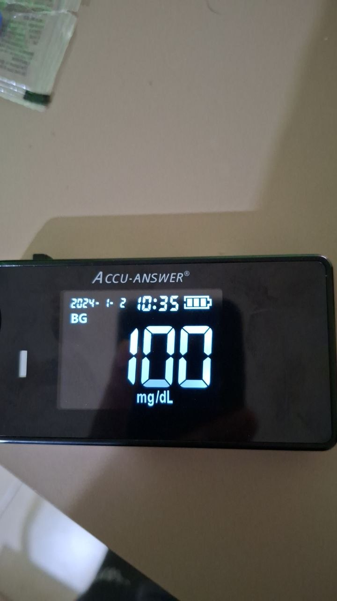
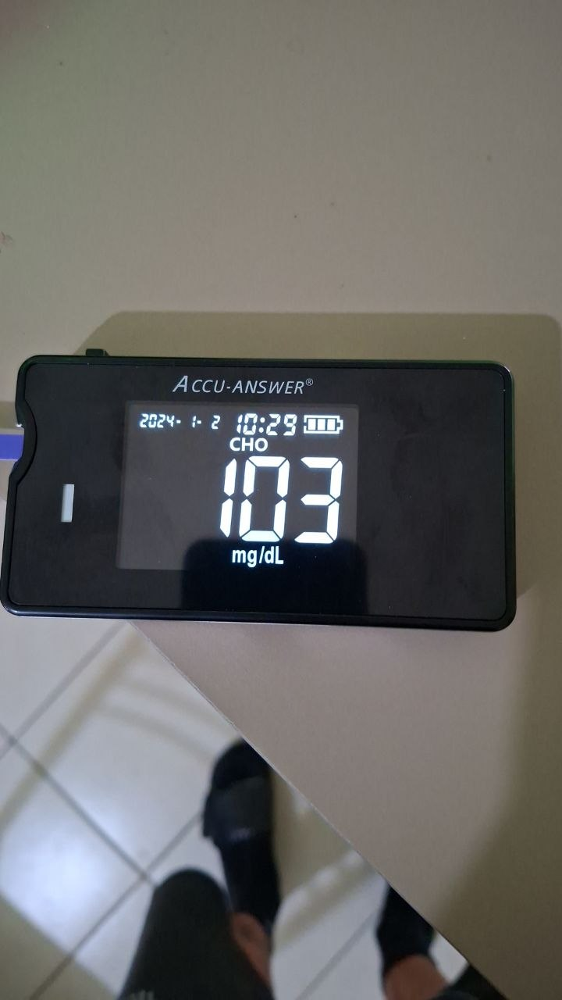
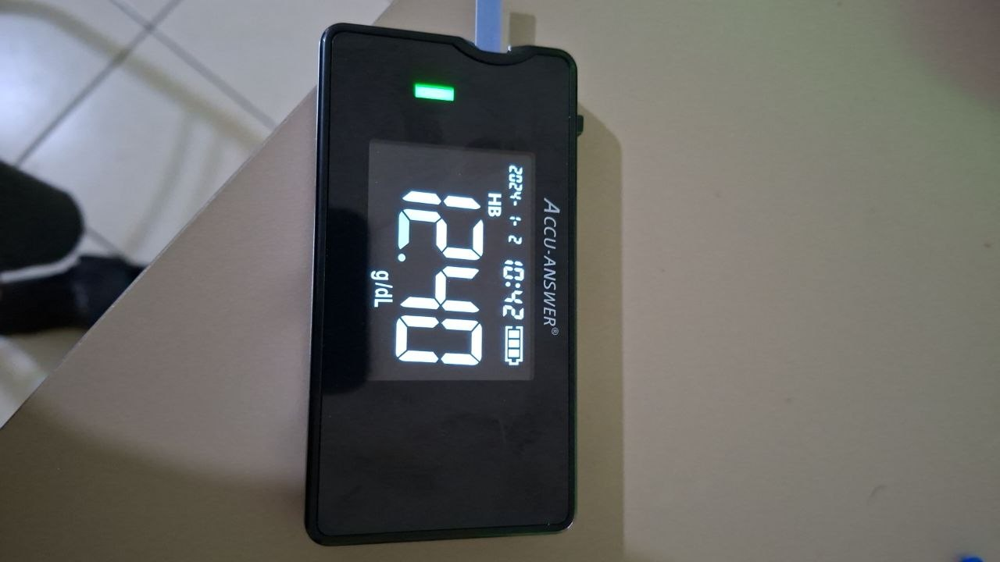
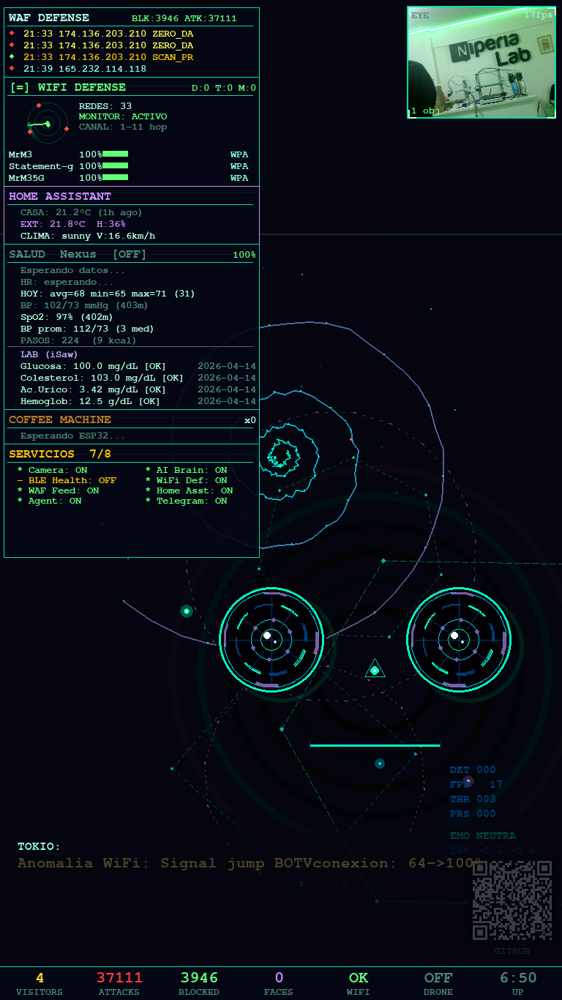

<div align="center">

# 🏥 Health Monitoring System

**Real-time health tracking with AI-powered medical device integration**

*Part of the TokioAI Quantified Self / Biohacking philosophy*

</div>

---

## Philosophy: Quantified Self & Biohacking

TokioAI's health monitoring system is born from a personal philosophy of **quantified self** and **biohacking** — the practice of using technology, data, and self-experimentation to take control of your own health.

> **"Don't just accept a diagnosis — understand it, measure it, track it, and improve it."**

This isn't about replacing doctors. It's about being an **informed, data-driven patient** who actively participates in their own health journey. The creator of TokioAI has practiced this philosophy for years:

- 🔴 **Built custom red light therapy (RLT) devices** — DIY panels using 660nm/850nm LEDs for skin, hair, and tissue regeneration, with measurable improvements tracked over months
- 💊 **Avoided unnecessary surgery** through personal research — a diet protocol recommended by a doctor years ago, combined with self-monitoring, prevented an organ removal that was being recommended
- 📊 **Avoided statins** through lifestyle optimization — instead of accepting lifelong medication for high cholesterol (250 mg/dL), used diet, exercise, and continuous monitoring to bring it down to 103 mg/dL naturally (**-58.8% reduction**)
- 🧪 **Self-funded blood work** — regular testing with devices like the Accu-Answer iSaw to track trends without waiting for annual checkups

### Why automate health tracking?

Because **data you don't collect is data you can't act on.** Most people get blood work once a year, see the results for 5 minutes, and forget them. With TokioAI:

- Every measurement is **stored with a timestamp**
- Trends are **visible over weeks, months, years**
- The AI **correlates metrics** (e.g., cholesterol dropping while HR improves = cardiovascular health improving)
- Alerts are **proactive** — the system tells you when something is trending in the wrong direction, not after it's already a problem

### Real Results

| Metric | Before | After | Change | How |
|--------|--------|-------|--------|-----|
| Cholesterol | 250 mg/dL | 103 mg/dL | **-58.8%** | Diet + exercise + monitoring |
| Resting HR | 86 bpm | 66 bpm | **-23.3%** | Cardiovascular fitness |
| Uric Acid | 5.2 mg/dL | 3.42 mg/dL | **-34.2%** | Diet adjustment |
| Blood Pressure | 130/85 | 102/73 | **-21.5%/-14.1%** | Lifestyle changes |

These aren't theoretical numbers — they're real measurements tracked by TokioAI over time.

---

## Overview

TokioAI integrates real-time health monitoring through two data sources:

1. **BLE Smartwatch** — Continuous heart rate, blood pressure, SpO2, and step tracking via Bluetooth Low Energy
2. **Accu-Answer iSaw 4-in-1** — Lab-grade glucose, cholesterol, hemoglobin, and uric acid readings via AI-powered OCR

All health data is stored in a local SQLite database on the Raspberry Pi, displayed on the Entity's live panel, and accessible via CLI, Telegram, or API.

## Architecture

```
┌──────────────┐     BLE      ┌──────────────────┐     SQLite     ┌──────────────┐
│  Smartwatch  │────────────→│   Raspberry Pi    │──────────────→│  Health DB   │
│  (HR/BP/SpO2)│              │   Entity Server   │               │  (1900+ rows)│
└──────────────┘              └────────┬─────────┘               └──────┬───────┘
                                       │                                │
┌──────────────┐   Telegram    ┌───────┴────────┐    API          ┌─────┴────────┐
│ Accu-Answer  │──→ Photo ──→│  GCP Agent      │──────────────→│  Entity API  │
│ iSaw 4-in-1  │   + OCR      │  (Gemini Vision)│               │  /health/*   │
└──────────────┘              └────────────────┘               └──────────────┘
                                       │
                              ┌────────┴────────┐
                              │  CLI / Telegram  │
                              │  Health Reports  │
                              └─────────────────┘
```

## Supported Metrics

| Metric | Source | Unit | Normal Range | Frequency |
|--------|--------|------|-------------|-----------|
| Heart Rate | BLE Smartwatch | bpm | 60-100 | Continuous (every 5s) |
| Blood Pressure | BLE Smartwatch | mmHg | <120/80 | On-demand |
| SpO2 | BLE Smartwatch | % | 95-100 | Continuous |
| Steps | BLE Smartwatch | count | — | Daily |
| Glucose | Accu-Answer iSaw | mg/dL | 70-100 | On-demand |
| Cholesterol | Accu-Answer iSaw | mg/dL | <200 | On-demand |
| Hemoglobin | Accu-Answer iSaw | g/dL | 11.0-16.0 | On-demand |
| Uric Acid | Accu-Answer iSaw | mg/dL | 3.4-7.0 | On-demand |

## Accu-Answer iSaw Integration

The [Accu-Answer iSaw 4-in-1](https://www.accuanswer.com/) is a multi-parameter blood testing device that measures glucose, cholesterol, hemoglobin, and uric acid from a single finger-prick blood sample.

**The device has no Bluetooth or WiFi connectivity.** TokioAI integrates it through AI-powered OCR:

### How it works

1. **Take a measurement** with the iSaw device
2. **Send a photo** of the device's LCD screen to TokioAI via Telegram
3. **Gemini Vision** reads the display and extracts the metric and value
4. **Agent stores** the reading in the health database with timestamp
5. **Entity displays** the latest values on its live panel

### Example readings from Accu-Answer iSaw 4-in-1

<table>
<tr>
<td align="center"><br><b>🔵 Glucose</b><br>100 mg/dL 🟢</td>
<td align="center"><br><b>🟣 Cholesterol</b><br>103 mg/dL 🟢</td>
<td align="center"><br><b>🔴 Hemoglobin</b><br>12.5 g/dL 🟢</td>
<td align="center"><br><b>🟠 Uric Acid</b><br>3.42 mg/dL 🟢</td>
</tr>
</table>

> 🏆 **Key achievement**: Cholesterol reduced from **250 → 103 mg/dL** (-58.8%) without statins.

### Entity Health Dashboard

The Entity displays all health data in real-time on the Raspberry Pi 5 screen:



*Live vitals from BLE smartwatch + lab results from Accu-Answer iSaw, displayed on the Entity's face screen.*

### AI Analysis Example

When all metrics are collected, TokioAI generates a comprehensive health analysis:

```
🏥 Health Report — April 14, 2026
━━━━━━━━━━━━━━━━━━━━━━━━━━━━━━━

📊 Overall Score: 9.0/10 🟢

❤️  Heart Rate     66 bpm      ↓ Improving (was 86)     10/10
🩸  Blood Pressure 102/73 mmHg ↓ Improving               9/10
🫁  SpO2           97%         → Stable                   9/10
🟣  Cholesterol    103 mg/dL   ↓↓ -58.8% (was 250!)    10/10
🔵  Glucose        100 mg/dL   → Stable                   8/10
🔴  Hemoglobin     12.5 g/dL   → OK (Accu-Answer range)  8/10
🟠  Uric Acid      3.42 mg/dL  ↓ -34% (was 5.2)         9/10

🏆 Key Achievement: Cholesterol from 250 → 103 mg/dL (-58.8%)
   without statins, through diet and lifestyle changes alone.
```

## BLE Smartwatch Integration

The smartwatch connects via Bluetooth Low Energy to the Raspberry Pi's BLE adapter. The `health_monitor.py` module handles:

- **Auto-discovery** — Scans for compatible BLE devices
- **Continuous monitoring** — Reads HR/SpO2 every 5 seconds
- **Auto-reconnect** — Reconnects if the device disconnects
- **Battery tracking** — Monitors smartwatch battery level

### Supported protocols

| Service UUID | Characteristic | Data |
|-------------|---------------|------|
| `0x180D` | Heart Rate Measurement | HR in bpm |
| `0x1822` | Blood Pressure | Systolic/Diastolic mmHg |
| `0x1816` | SpO2 | Oxygen saturation % |

## API Endpoints

### Entity (Raspberry Pi :5000)

| Endpoint | Method | Description |
|----------|--------|-------------|
| `/health` | GET | Current readings from BLE |
| `/health/db/latest` | GET | Latest lab values from DB |
| `/health/db/store` | POST | Store new lab reading |
| `/health/db/history` | GET | Historical readings |

### Store a reading

```bash
curl -X POST http://localhost:5000/health/db/store \
  -H "Content-Type: application/json" \
  -d '{"metric": "glucose", "value": 100, "unit": "mg/dL", "source": "accu-answer-isaw"}'
```

### Query history

```bash
# Latest readings
curl http://localhost:5000/health/db/latest

# History for a specific metric (last 30 days)
curl "http://localhost:5000/health/db/history?metric=glucose&days=30"
```

## CLI Commands

```bash
# Quick health status
tokio> /health

# Full health report with history
tokio> show me my complete health report

# Store a reading manually
tokio> store glucose 95, cholesterol 180

# Health trend analysis
tokio> analyze my health trends for the last month
```

## Telegram Commands

```
# Send a photo of iSaw → auto-stored
📷 [photo of iSaw display]

# Ask for report
"Show me my health history"
"Health report"
"How is my cholesterol trending?"
```

## Data Privacy

- All health data is stored **locally** on the Raspberry Pi (SQLite)
- No health data is sent to external cloud services
- Photos of medical devices are processed by Gemini Vision but not stored by Google
- The health database is excluded from git via `.gitignore`
- No personal health data is included in this repository — only anonymizable examples

## Setup

### BLE Smartwatch

```bash
# Install BLE dependencies
pip install bleak

# The health monitor starts automatically with the Entity
systemctl start tokio-entity
```

### Accu-Answer iSaw

No setup needed — just send photos via Telegram. The agent automatically:
1. Detects it's a medical device image
2. Reads the value via Gemini Vision OCR
3. Stores it in the health database
4. Confirms with a summary

### Health Database

The database is created automatically on first use at `~/tokio_raspi/health_db.sqlite`:

```sql
CREATE TABLE health_readings (
    id INTEGER PRIMARY KEY AUTOINCREMENT,
    metric TEXT NOT NULL,        -- 'glucose', 'cholesterol', etc.
    value REAL NOT NULL,         -- numeric value
    unit TEXT DEFAULT 'mg/dL',   -- unit of measurement
    source TEXT DEFAULT 'manual', -- 'ble', 'accu-answer-isaw', 'manual'
    timestamp DATETIME DEFAULT CURRENT_TIMESTAMP
);
```

## Future Roadmap

- [ ] **OCR from Entity camera** — Point the iSaw at the Raspberry Pi camera for hands-free reading
- [ ] **Voice input** — "Tokio, glucose 95" stored via speech recognition
- [ ] **Correlation engine** — Automatic cross-metric analysis (e.g., diet changes vs cholesterol)
- [ ] **Export to PDF** — Periodic health reports for doctor visits
- [ ] **Multi-user support** — Track health for family members
- [ ] **Integration with more devices** — Blood pressure monitors, scales, CGMs

---

<div align="center">

*Built with the belief that everyone should have access to their own health data, in real-time, analyzed by AI, without depending on annual checkups or expensive platforms.*

**Your body, your data, your control.**

</div>
